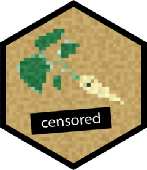

<!-- README.md is generated from README.Rmd. Please edit that file -->

# censored <a href='https://censored.tidymodels.org'></a>

<!-- badges: start -->

[](https://github.com/tidymodels/censored/actions/workflows/R-CMD-check.yaml)
[](https://app.codecov.io/gh/tidymodels/censored?branch=main)
[](https://lifecycle.r-lib.org/articles/stages.html)
[](https://github.com/tidymodels/censored/actions/workflows/R-CMD-check-hard.yaml)
<!-- badges: end -->

`censored` is a [parsnip](https://parsnip.tidymodels.org) extension
package which provides engines for various models for censored
regression and survival analysis.

## Installation

You can install the released version of censored from
[CRAN](https://CRAN.R-project.org) with:

``` r
install.packages("censored")
```

And the development version from [GitHub](https://github.com/) with:

``` r
# install.packages("pak")
pak::pak("tidymodels/censored")
```

## Available models, engines, and prediction types

censored provides engines for the models in the following table. For
examples, please see [Fitting and Predicting with
censored](https://censored.tidymodels.org/articles/articles/examples.html).

The time to event can be predicted with `type = "time"`, the survival
probability with `type = "survival"`, the linear predictor with
`type = "linear_pred"`, the quantiles of the event time distribution
with `type = "quantile"`, and the hazard with `type = "hazard"`.

| model | engine | time | survival | linear_pred | raw | quantile | hazard |
|:---|:---|:---|:---|:---|:---|:---|:---|
| bag_tree | rpart | ✔ | ✔ | ✖ | ✖ | ✖ | ✖ |
| boost_tree | mboost | ✔ | ✔ | ✔ | ✖ | ✖ | ✖ |
| decision_tree | rpart | ✔ | ✔ | ✖ | ✖ | ✖ | ✖ |
| decision_tree | partykit | ✔ | ✔ | ✖ | ✖ | ✖ | ✖ |
| proportional_hazards | survival | ✔ | ✔ | ✔ | ✖ | ✖ | ✖ |
| proportional_hazards | glmnet | ✔ | ✔ | ✔ | ✔ | ✖ | ✖ |
| rand_forest | partykit | ✔ | ✔ | ✖ | ✖ | ✖ | ✖ |
| rand_forest | aorsf | ✔ | ✔ | ✖ | ✖ | ✖ | ✖ |
| survival_reg | survival | ✔ | ✔ | ✔ | ✖ | ✔ | ✔ |
| survival_reg | flexsurv | ✔ | ✔ | ✔ | ✖ | ✔ | ✔ |
| survival_reg | flexsurvspline | ✔ | ✔ | ✔ | ✖ | ✔ | ✔ |

## Contributing

This project is released with a [Contributor Code of
Conduct](https://contributor-covenant.org/version/2/0/CODE_OF_CONDUCT.html).
By contributing to this project, you agree to abide by its terms.

- For questions and discussions about tidymodels packages, modeling, and
  machine learning, please [post on Posit
  Community](https://forum.posit.co/new-topic?category_id=15&tags=tidymodels,question).

- If you think you have encountered a bug, please [submit an
  issue](https://github.com/tidymodels/censored/issues).

- Either way, learn how to create and share a
  [reprex](https://reprex.tidyverse.org/articles/articles/learn-reprex.html)
  (a minimal, reproducible example), to clearly communicate about your
  code.

- Check out further details on [contributing guidelines for tidymodels
  packages](https://www.tidymodels.org/contribute/) and [how to get
  help](https://www.tidymodels.org/help/).
